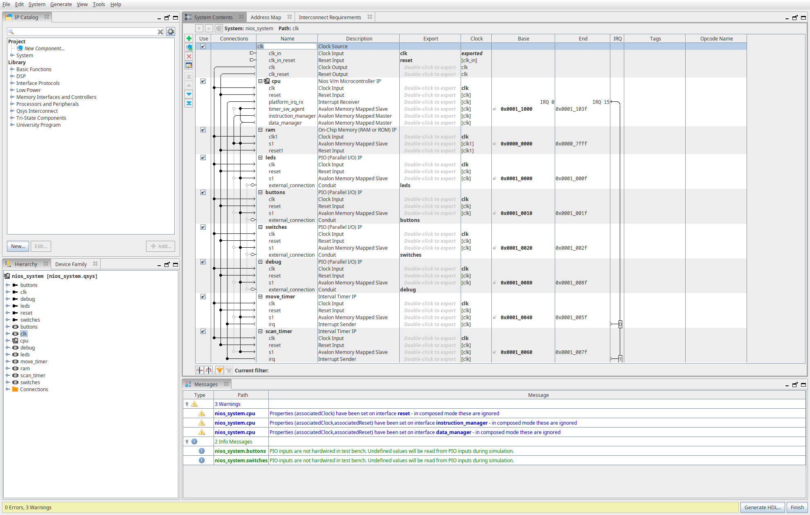
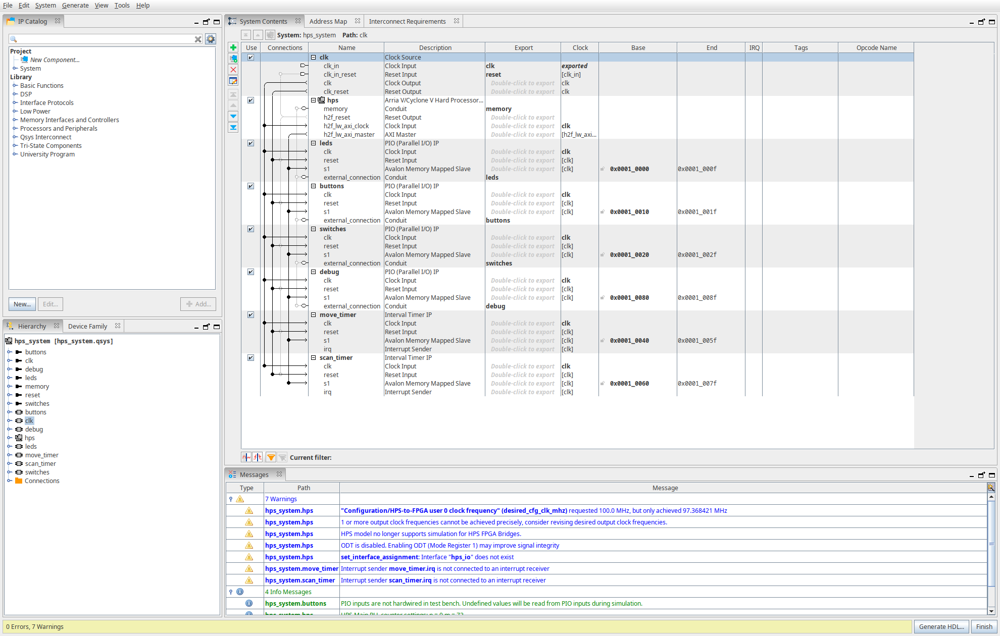
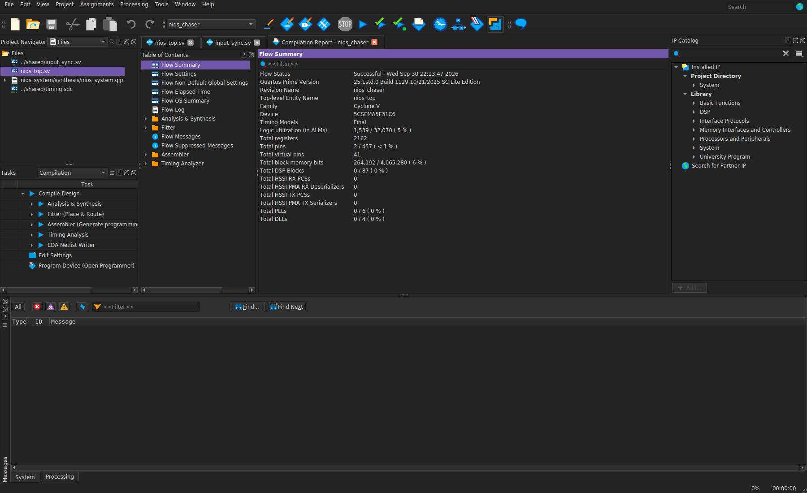
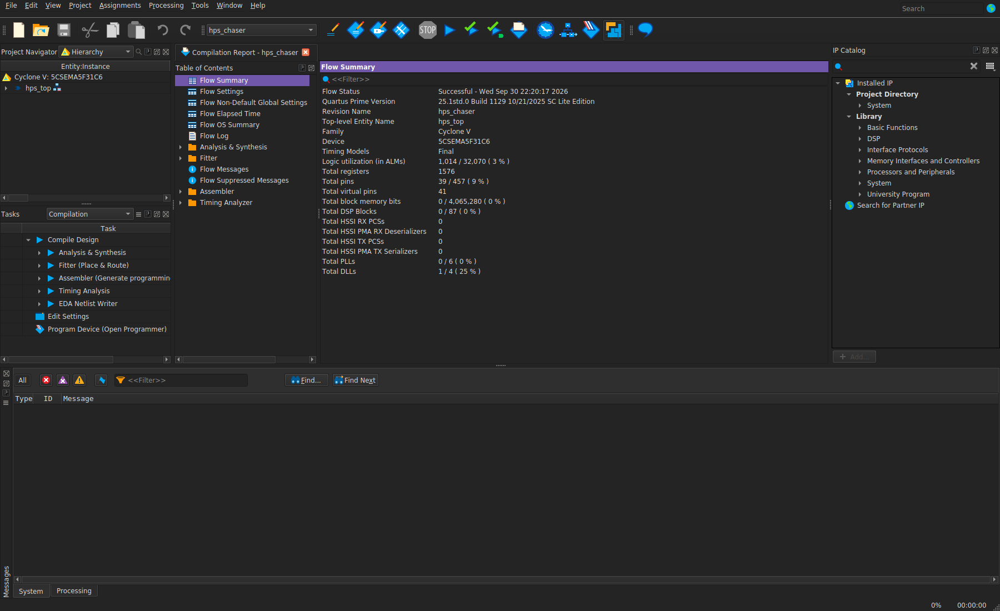
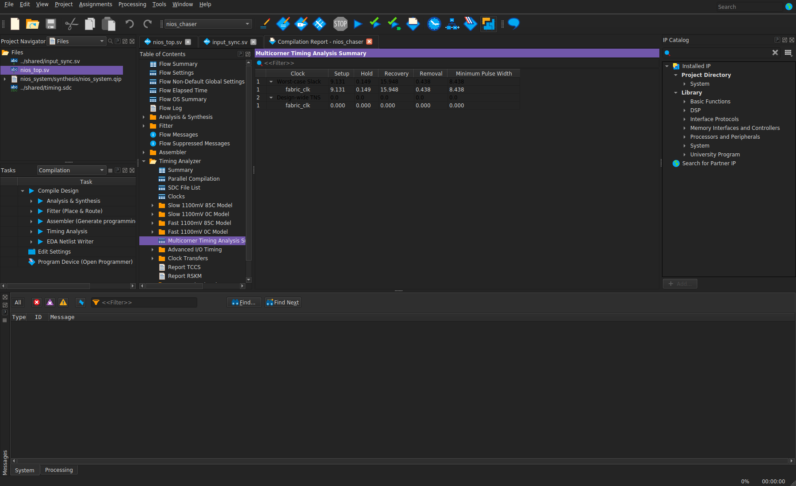
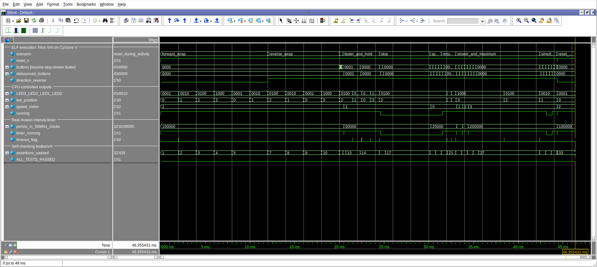
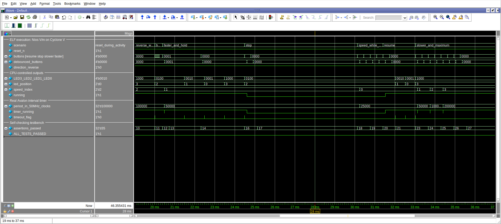

# Домашнє завдання — Лекція 10

Зроблено у Quartus Prime Lite 25.1 під Cyclone V SoC (5CSEMA5F31C6).
Тому замість компонентів із Vivado використав такі:

- Zynq PS → HPS з ARM Cortex-A9;
- MicroBlaze → Nios V/m;
- Block Design → Platform Designer;
- AXI GPIO → Avalon PIO;
- AXI Timer → Avalon Interval Timer.

Програму зібрав через Clang/LLVM, симуляцію запускав у Questa.
Плати немає, тому перевірка через симуляцію та збірку проєктів.

Логіка однакова для обох варіантів: один LED рухається по колу, перемикач змінює
напрямок, а кнопки — швидкість, зупинку та продовження. Час відраховує апаратний
таймер. Код програми спільний, лежить у `shared/`.

---

**1. Система з Nios V**

Тут зібрана система в Platform Designer: Nios V/m, пам'ять для програми,
PIO для LED, кнопок і перемикача. Один таймер задає швидкість руху,
другий використовується для опитування кнопок. Також виведений статус для тестбенча.

---

**2. Система з HPS**

Тут той самий набір PIO і таймерів, але замість Nios використовується HPS.
Периферія підключена через lightweight HPS-to-FPGA bridge.

Для HPS зібраний ARM ELF, але виконання ARM-коду не симулювалося:
у цій версії IP немає підтримки симуляції HPS–FPGA bridge.
Тому для HPS є результат компіляції, а виконання програми перевірене на Nios.

---

**3. Компіляція Nios V**

Проєкт пройшов повну компіляцію. На скріні видно Cyclone V, статус Successful
і використані ресурси: 1539 ALM та 2162 регістри. Помилок немає, попередження є.

---

**4. Компіляція HPS**

Другий проєкт також зібрався без помилок. Тут використано 1014 ALM
і 1576 регістрів у FPGA-частині.

---

**5. Перевірка timing**

Для Nios заданий clock 50 MHz. Тут видно додатний slack:
setup +9,131 ns, hold +0,149 ns.

---

**6. Симуляція Nios з ELF**

Процесор виконує програму з ELF, завантажену в пам'ять системи.
Тестбенч перемикає входи й перевіряє результат.
На waveform видно рух LED вперед і назад, зміну швидкості, паузу та reset.

У кінці `assertions_passed = 35`, `ALL_TESTS_PASSED = 1`.
За симуляцію відбулося 20 перемикань LED.

---

**7. Кнопки та зупинка**

Тут збільшений фрагмент із кнопками. Короткі імпульси відкидаються,
а утримування кнопки не змінює швидкість повторно.
Після STOP сигнали `running` і `timer_running` переходять у 0,
LED залишається на місці. Швидкість можна змінити й під час паузи.
Після RESUME таймер запускається з новим періодом і рух продовжується.

---

Керування: `buttons[0]` — швидше, `[1]` — повільніше, `[2]` — STOP,
`[3]` — RESUME. `direction` обирає напрямок.

Проєкти: [Nios V](task2_nios/nios_chaser.qpf), [HPS](task1_hps/hps_chaser.qpf).
[Логи](evidence/logs/), [waveform WLF](evidence/nios_simulation.wlf),
[VCD](evidence/nios_simulation.vcd.gz), [команди збірки](docs/BUILD.md)
та [детальні результати](docs/REPORT.md).
